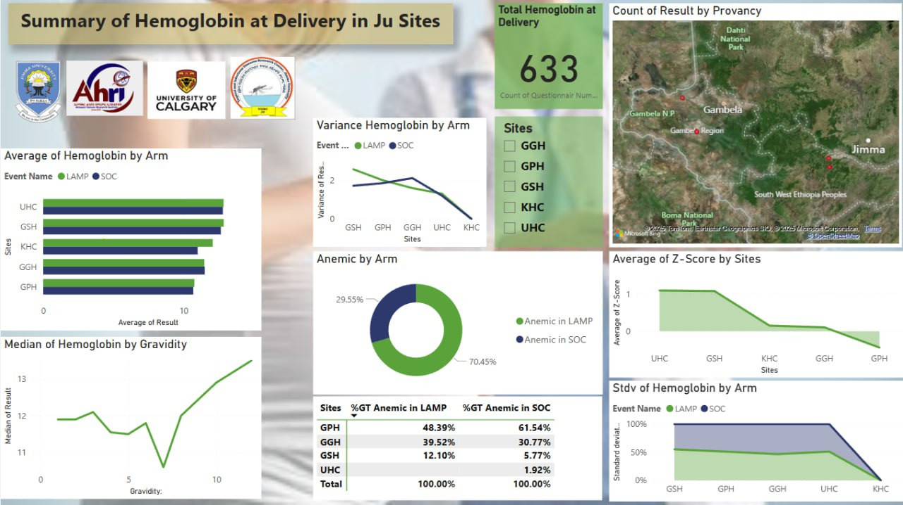

# Summary-of-Hemoglobin-at-Delivery-for-JU-Sites-Using-Power-BI-

 📊 Overview
This dashboard provides a comprehensive analysis of hemoglobin levels at delivery across multiple study sites in Ethiopia. The data visualization presents key metrics including anemia prevalence, hemoglobin distribution by various demographic factors, and site-specific comparisons.

 🗺️ Study Sites
The dashboard covers data from the following sites:
- LAMP (Lamp Experimental Group)
- SOC (Standard of Care Control Group)
- GPH 
- GSH 
- KHC 
- UHC (Urban Health Center)

 🖼️ Dashboard Preview

 📈 Key Metrics
 1. Total Hemoglobin Count
- Total Sample Size: 633 participants
- Comprehensive data collection across all sites

 2. Anemia Prevalence by Arm
- Overall Anemia Rate: 70.45%
- Non-Anemic Rate: 29.55%

 3. Average Hemoglobin by Arm
- Comparative analysis between LAMP and SOC interventions
- Site-specific averages across all six locations

 4. Hemoglobin Distribution by Gravidity
- Analysis across gravidity categories (0, 5, 10+)
- Understanding hemoglobin trends with increasing parity
 5. Anemia by Z-Score
- LAMP arm: 48.39% anemic
- SOC arm: 39.52% anemic
- Z-score analysis by site and intervention

 6. Site-Specific Anemia Rates (%GT Anemic)
- LAMP Arm:
  - GPH: 48.39%
  - GGH: 39.52%
  - GSH: 12.10%
  - UHC: 100.00%

- SOC Arm:
  - GPH: 61.54%
  - GGH: 30.77%
  - GSH: 5.77%
  - UHC: 1.92%

 7. Geographic Distribution
- Map visualization showing data provenance across Ethiopian regions:
  - Gambella Region
  - South West Ethiopia People's Region
 🎯 Key Insights

1. High Anemia Burden: 70.45% of participants are anemic, indicating a significant public health concern
2. Site Variation: UHC shows the highest rates in LAMP arm (100%), while GSH has the lowest rates in both arms
3. Intervention Comparison: Anemia rates differ between LAMP (48.39%) and SOC (39.52%) based on Z-score analysis
4. Gravidity Trends: Hemoglobin levels vary across different gravidity categories

 🛠️ Data Collection
The dashboard aggregates data from:
- Hemoglobin measurements at delivery
- Demographic information (gravidity, site location)
- Intervention arm assignment (LAMP vs SOC)
- Z-score calculations for anemia assessment

 📍 Geographic Coverage
Data were collected across multiple Ethiopian regions, providing a comprehensive geographic representation of the study population.

 🔍 Usage Notes
- All data points represent hemoglobin levels measured at delivery
- Anemia classification follows standard WHO guidelines
- %GT Anemic represents the percentage of participants with gestational thrombocytopenia anemia
- Site abbreviations correspond to specific health facilities in Ethiopia
 📝 Acknowledgments
Data visualized with support from:
- Ethiopian National Geographic Society, 2025
- National Geographic (Damo region)
- Geographic Society partners

 📅 Data Period
- Collection Period: 2021 - 2023
- Analysis conducted at delivery time points
For detailed methodology and analysis, please refer to the accompanying research documentation.

Version: 1.0
Last Updated: March 2025

